# 金好運 台版/東南亞版 1年概況

### 主要工作內容
- UI換皮
- UI新增功能及優化
- server串接
- 小型錯誤修正

## 主要使用工具
### 遊戲引擎
- Unity
### 使用語言
- C#
### 追蹤工具
- Git
- TortoiseGit
### 美術打包工具
- TexturePacker
### AI輔助
- Claude, ChatGPT
# 大致工作流程

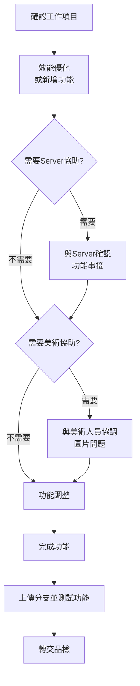
```mermaid
flowchart TD

A[確認工作項目]
B[效能優化<br/>或新增功能]

C{需要Server協助?}
D[與Server確認<br/>功能串接]

E{需要美術協助?}
F[與美術人員協調<br/>圖片問題]

G[功能調整]
H[完成功能]
I[上傳分支並測試功能]
J[轉交品檢]

A --> B
B --> C

C -->|需要| D
C -->|不需要| E
D --> E

E -->|需要| F
E -->|不需要| G
F --> G

G --> H
H --> I
I --> J
```

## 1.排行榜美術優化

| 修改前 | 修改後 |
|--------|--------|
| 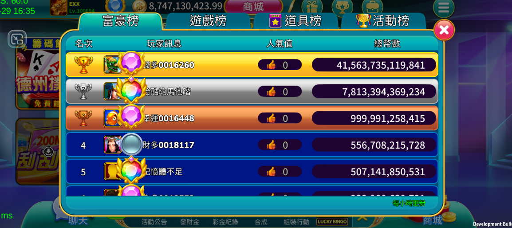 | 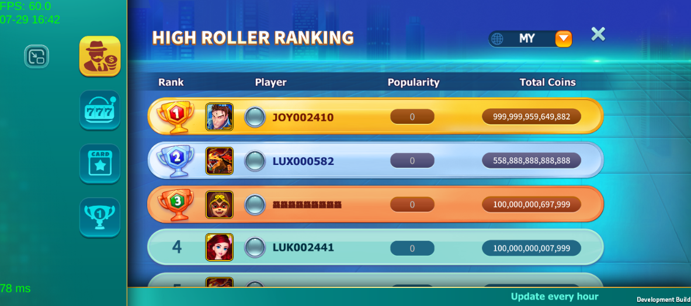 |

📌工作內容：
- 調整UI排版
- 更換美術圖

 🚧 困難與解決
- 首次接觸TexturePacker打包與美術資源替換。
- 首次接觸TorToiseGit追蹤工具。
- 熟悉腳本控制圖片載入。
- 多國語系差異與相關工具認識。
- 發版前的資源包類別，避免不必要的更新。

這是我首次接觸大型專案的第一份工項，也是接觸最多新工具的時候。
第一個遇到的困難是更換圖片，這段時間也從其他同仁那邊學到如何用TexturePacker包圖跟更換圖片，而當時我以為只要直接為物件更換圖片就好，但遊戲內圖片都沒換到，自己摸索一段時間才知道專案內有使用代碼調用方法來更換圖片。
同時知道還有多國版本的美術圖片需要更換，也是在這邊開始熟悉不同語系換圖會碰到的問題(不同語系圖片大小不同需要根據語系調整位置、大小等)。
完成後的發版測試還需要知道要更新哪些資源包避免不必要的浪費。

## 2.背包美術優化

| 修改前 | 修改後 |
|--------|--------|
| 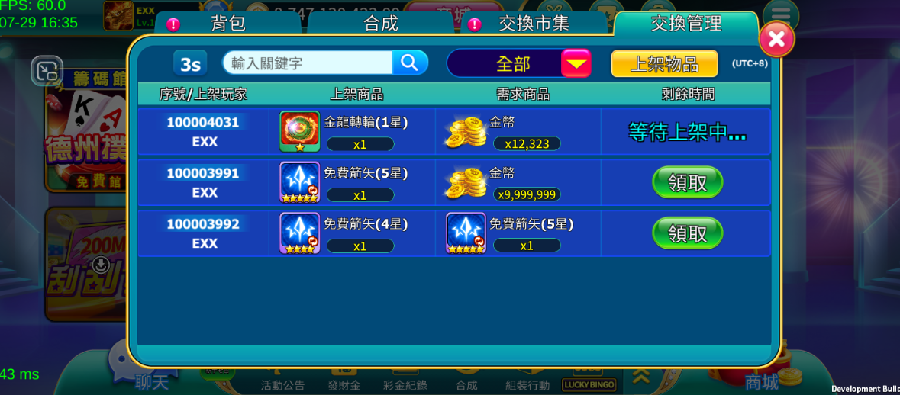 | 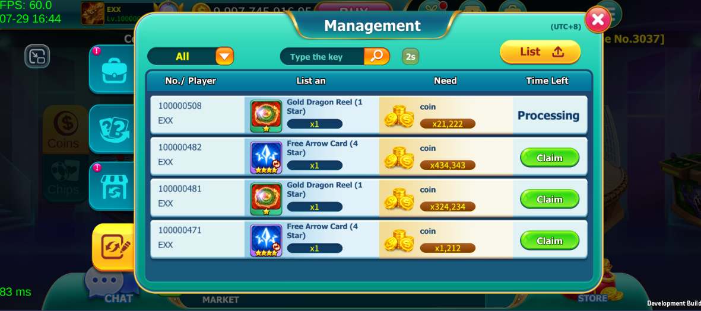 |

📌工作內容：
- 調整UI排版
- 更換美術圖

🚧 困難與解決
- 理解更複雜的既有架構與物件建立。
- 對TortoiseGit的追蹤與修改確認流程不熟悉，透過同仁指導與實際使用逐漸熟悉版本管理流程。

接在排行榜後的第二個項目，工項內容大致上跟排行榜一樣，但是代碼架構比排行榜還要更複雜一些，我在這裡更熟悉公司內自己的prefabs生成方法，也在這裡學到了多國文案的更新流程。這個項目沒碰到太多的問題。
在這裡我還不算熟悉TortoiseGit的追蹤功能，常常漏掉自己的修改導致做白工，經過了同仁的教導跟自己嘗試更理解了這個工具。

## 3.商城改版+優化

| 修改前 | 修改後 |
|--------|--------|
| 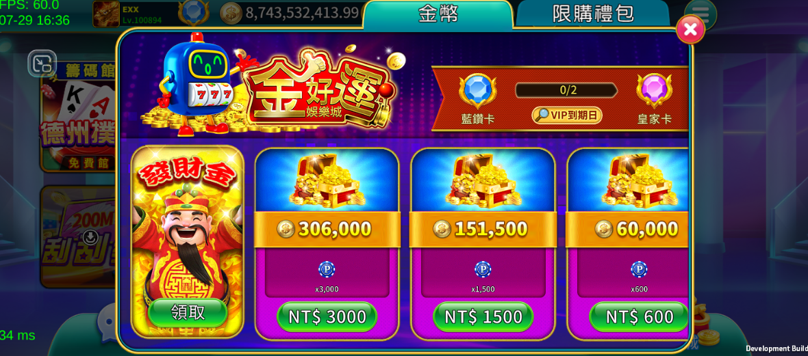 | 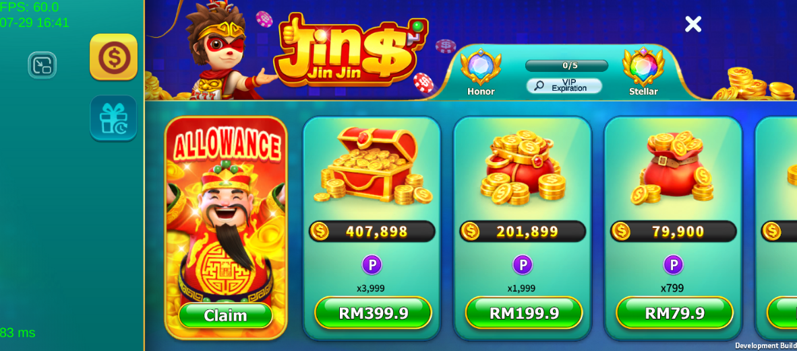 |

📌工作內容：
- 調整UI排版
- 更換美術圖
- NGUI改版UGUI

 🚧 困難與解決
- 第一次NGUI轉UGUI完整介面改版，重新理解兩套UI系統在配置、事件及程式撰寫方式上的差異。
- 認識不同平台(iOS、Android、Download APK)有不同的介面與流程，避免改版後造成特定版本異常。
- 理解美術資源從下載、載入到顯示的流程，透過閱讀既有程式碼與工具輔助來理解架構。
- 中途發現有超出原規劃範圍外的功能也需要同步進行優化，經過與相關人員確認後，調整開發安排。

商城是我第一個實作NGUI to UGUI的優化項目，也是第一個較大的優化項目，這次的困難點是全面把一個NGUI的UI介面替換成UGUI的物件跟代碼寫法，在這裡也花了不少時間摸索NGUI跟UGUI這兩種使用方法的差異，也在這裡認識到還有分ios、android跟Download apk這三種不同環境對應不同的介面跟流程(ios跟android使用相同介面download版有自己的網頁介面)，在這裡碰到了不少困難。
在這裡我也第一次接觸到圖片下載跟串接方法流程，這些方法一開始很難理解，後來是用了AI輔助才理解背後的原理。

在實作期間出現了新的問題大概也是我這一年中碰到最大的困難之一，由於當時只有要求修改金幣商城的介面，在接近截止日期前才發現籌碼館也有一個跟金幣商城共用同一個管理腳本的籌碼商城，由於時間抓得很緊，跟主管還有美術人員確認後才加班把籌碼商城也一起做優化改版(值得慶幸的是兩種商城的架構相差不大)。

## 4.彩金排行改版+優化

| 修改前 | 修改後 |
|--------|--------|
| 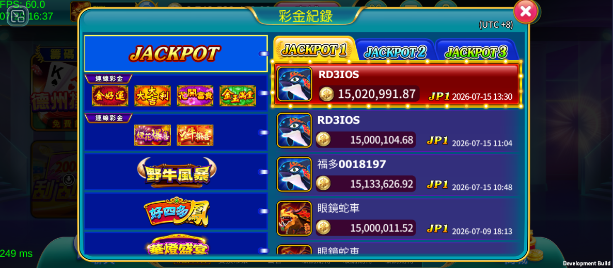 | 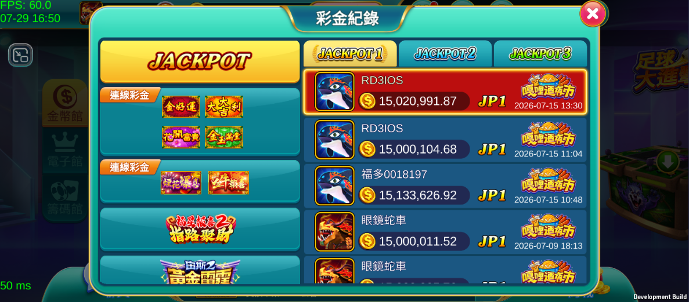 |

📌工作內容：
- 調整UI排版
- 更換美術圖
- NGUI改版UGUI

 🚧 困難與解決
- 初次遇到替換美術資源後無法正常套用的問題，確認資源管理腳本是否有正確處理UGUI資源。
- 深入理解專案的資源管理架構跟載入流程。

彩金紀錄改版是在我逐漸熟悉工作流程跟專案大致架構後執行的項目，這裡我第一次碰到了沒辦法應用新美術圖的問題，在向同仁詢問後得知是美術資源的管理腳本沒有把UGUI資源也列在裡面，也理解了不只是單純替換專案既有資源就能應用成功，知道美術資源也有不同的下載流程。

## 5.存摺改版+優化

| 修改前 | 修改後 |
|--------|--------|
| 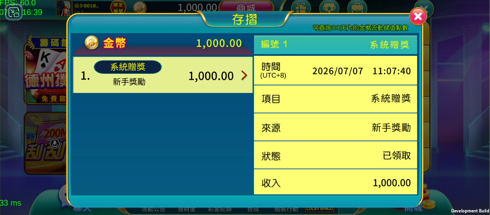 | 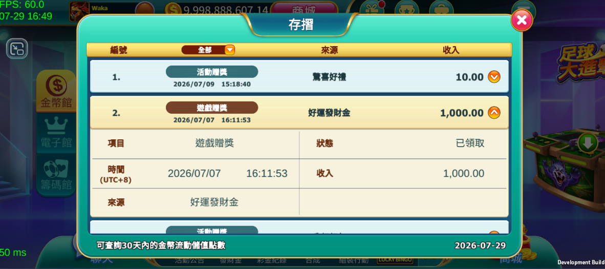 |

📌工作內容：
- 調整UI排版
- 更換美術圖
- NGUI改版UGUI
- 新增功能

 🚧 困難與解決
- 與Server端合作開發功能，理解前後端資料串接方式以及雙方負責的功能範圍。
- 透過觀察既有功能的串接方式，理解API呼叫與資料處理流程後，再套用到新的功能需求。

存摺改版是我第一次需要跟server合作的項目，這邊改版多了一項加入分類新功能的要求，需要server協助把大量不同的金流分為4種key，這裡我自己研究了串接方法，理解方法後試著模仿其他人串接的寫法，成功與server串接了新的分類功能。

## 6.贈禮改版+優化

| 修改前 | 修改後(東南亞畫面) |
|--------|--------|
| 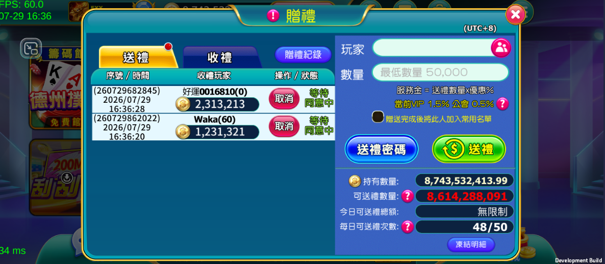 | 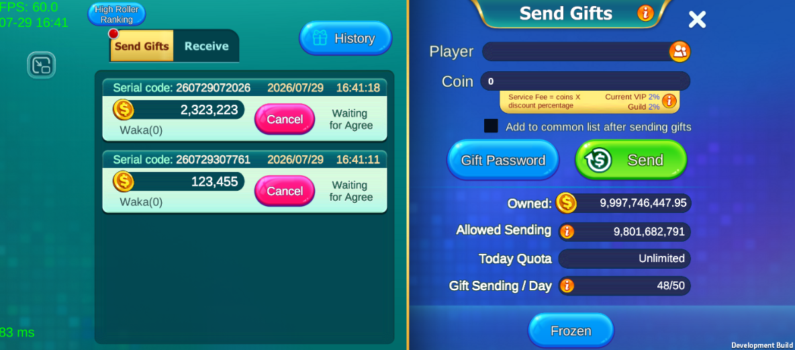 |

📌工作內容：
- 調整UI排版
- 更換美術圖
- NGUI改版UGUI

 🚧 困難與解決
- 多人合作下的Git版本管理與衝突整合。
- 養成檢查差異以及確認版本狀態的習慣，提升Git版本管理的熟悉。

贈禮改版差不多是入職半年後接到的工項，總體來說沒有碰到太多問題，此時我已經比較熟悉美術圖替換跟NGUI改UGUI流程，在這裡也是偶爾會碰上跟其他人有合併衝突的問題需要討論一下。
就在準備把完成的項目合併回主幹時我卻沒有檢查清楚修改項目，誤把舊的內容也一併合併回主幹上，感謝其他同仁協助解決了這個大烏龍，協助我建立更完整的版本確認習慣。

## 7. 登入頁、綁定有禮、帳號安全改版優化 + 共用提示彈窗改版優化

### 登入頁
| 修改前 | 修改後 |
|--------|--------|
| 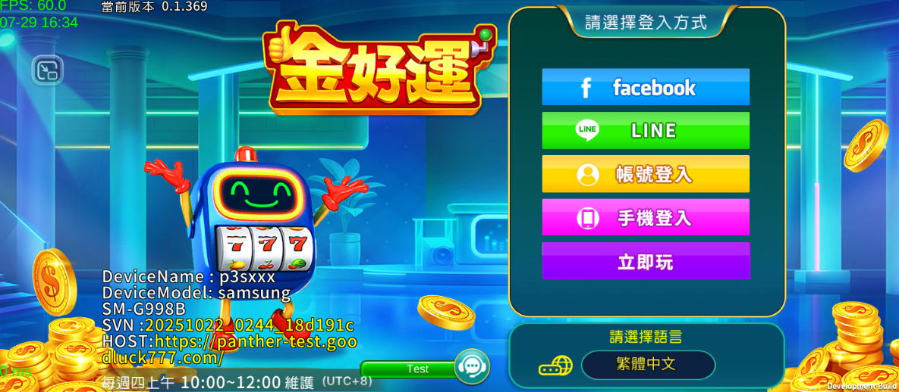 | 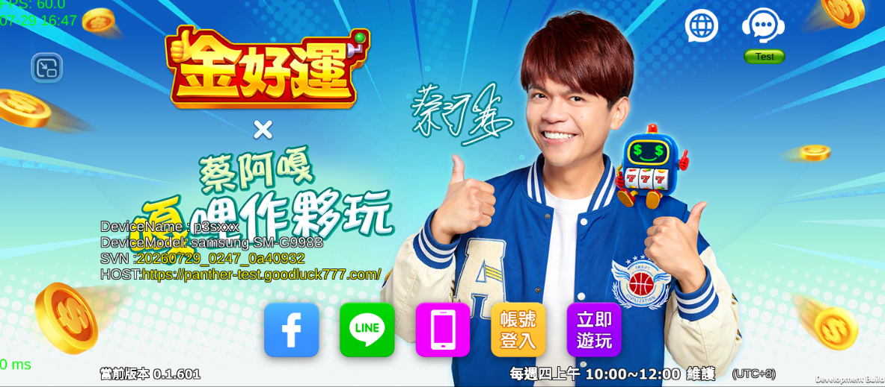 |

### 綁定有禮
| 修改前 | 修改後 |
|--------|--------|
| 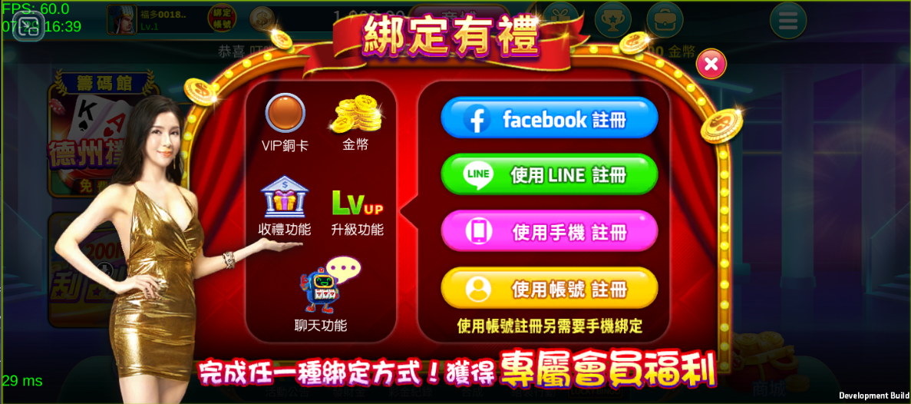 | 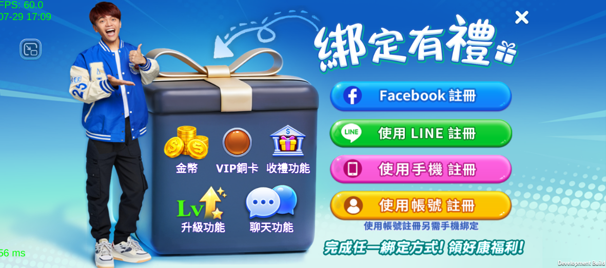 |

### 帳號安全
| 修改前 | 修改後 |
|--------|--------|
|  | 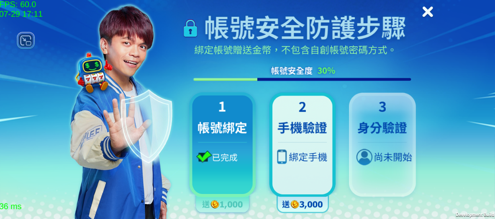 |

📌工作內容

- 調整 UI 排版
- 更換美術資源
- NGUI 改版至 UGUI

 🚧 困難與解決
- 重新理解整體場景管理方式與UI架構。
- 自行分析現有場景管理腳本並設計新的實作方式。
- 完成後曾出現登出流程卡住問題，初期驗證有遺漏，後續透過與同仁共同排查，累積排查經驗。

這三個項目原本是分開的，但登入功能同時會影響到綁定相關流程，所以同時一起做改版。這是我全部工項中實作過最大的一次改版，它涉及大量介面與遊戲場景，從登入畫面到進入大廳還有進入遊戲的加載，還要確保登入流程沒有問題避免玩家連遊戲都不能玩，每一個部分都跟以往的NGUI改UGUI優化不同，加上登入畫面是一次要修改整個遊戲場景，不再是單一的物件，所以很多地方的作法是沒有作業可以抄的，像是登入畫面我是根據自己的想法在現有的場景管理腳本來重建這個全UGUI的登入場景。

我花了不少時間使用AI輔助跟觀察其他人在遊戲場景的配置，當時測試出來的版本連登入畫面換皮本身都有很多問題，例如場景中的相機也要為了UGUI畫面一起做調整避免變形，但經過這一年的累積讓我能夠更快的理解這些結構龐大的腳本代碼背後都代表甚麼行為方法，也很順利的解決了許多困難。
雖然最後完成版本出現了意想不到的東南亞限定的遊戲登出卡住錯誤，當時我以為是場景管理的腳本的問題所以用了一種不合適但可運行的方式修正，感謝同仁後來的協助，排查出是在實作中漏掉了一個沒優化到的物件(看起來像是停用已久的LOGO動畫)，完成了這個項目。

## 8.小型項目
### 付費敲蛋
| 修改前 | 修改後 |
|--------|--------|
| 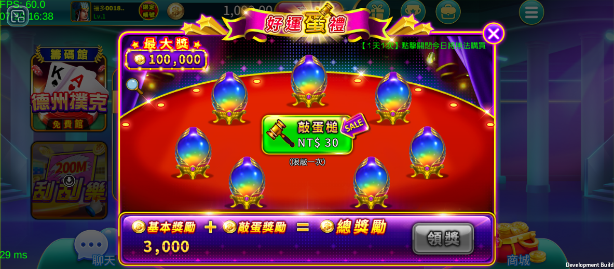 | 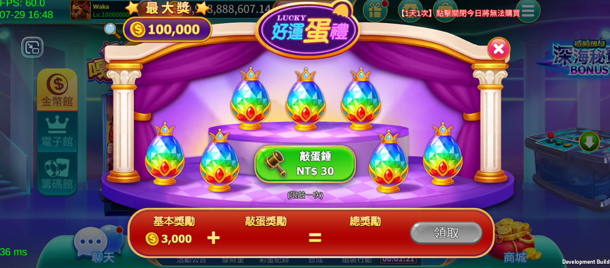 |

### 金幣換皮、大廳icon更新
| 修改前 | 修改後 |
|--------|--------|
| 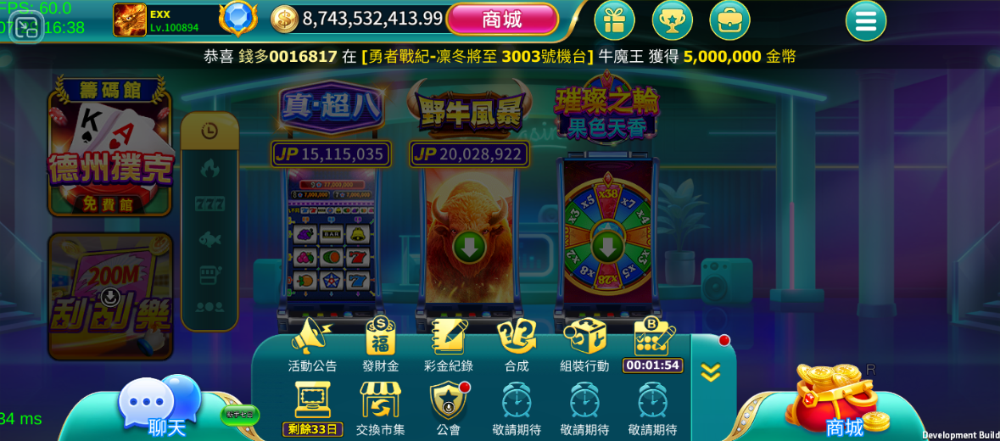 | 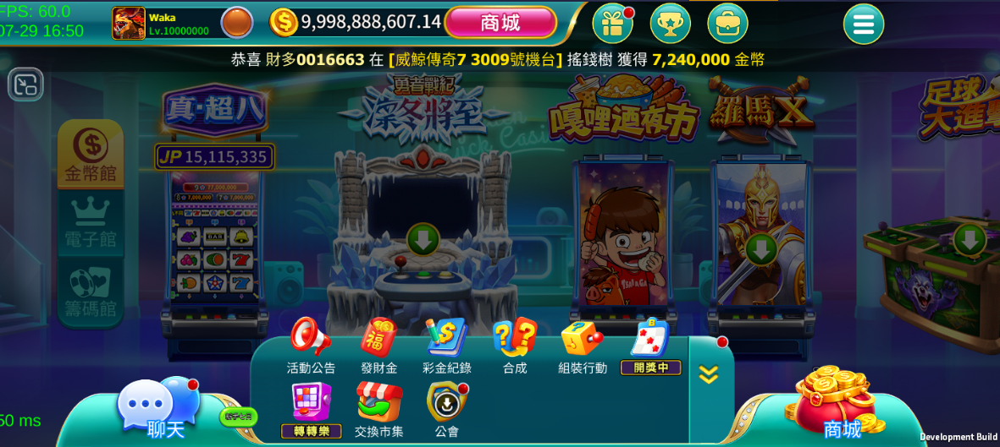 |

### 📌工作內容
- 調整 UI 排版
- 更換美術資源
- NGUI 改版至 UGUI

 🚧 困難與解決
- 部分畫面與規格書範例存在差異，與企劃、美術人員確認後進行調整。
- 使用Find Reference工具找出所有依賴關係避免遺漏。
- 部分物件需要等待美術重新提供資源才能替換，與主管、美術人員討論後調整，拆分成兩次版本更新。
- 理解大型專案中資源替換需要考慮資源依賴、更新範圍跟排程調整。

付費敲蛋作為較後期我相對順利的項目之一，NGUI改版UGUI過程上幾乎沒碰到問題，期間只有發現部分與規格書上的範例有差異，與企劃跟美術人員溝通後做了些許調整。

在金幣換皮項目期間較多的困難是找出專案內全部有使用到金幣圖案的任何物件，且全部替換成一個共用的圖片以便未來做統一更換，我使用了專案的工具(Find Reference)尋找任何跟舊金幣圖片有依賴關係的物件，其中包含了靜態、動畫跟特效物件，加上不少物件需要美術協助重新出圖才能替換，在與主管討論後決定分成兩次更新版本，第一次著重在靜態且可以直接替換圖片的物件上做修改，第二次則是等待美術完成後與動態物件一起替換。

## 9.其他
### Bug修正
除了較大的優化改版項目外不時會分配一些小Bug問題需要修正，大多在處理上沒有太多困難，有少數問題比較難確認處裡的必要(例如可能是因為個別特定裝置在特定條件下才會發生的引擎或裝置本身問題，又或是從沒在正式版本發布過的功能修正)這些都要跟分配的人員通知處理上的困難跟疑惑。

### 10.實作
在這一年間除了工項外我也對專案裡的工具腳本很感興趣，也有在家裡試著復刻相同的功能，例如素材資源加載(Asset Resource Load)，TortoiseGit的專案追蹤工具，還有我最感興趣的節省圖片資源打包(TexturePacker)跟把Spine動畫應用在unity裡，我自己嘗試做出了一個動畫功能，讓這個Spine動畫可以跟隨玩家的動作來做播放行為想在未來能應用在一些互動式動畫上。

### TortoiseGit測試
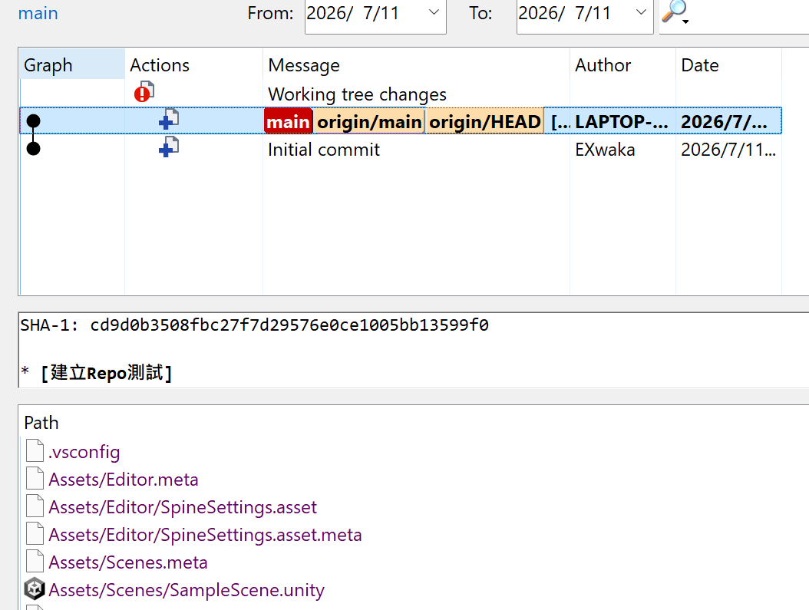
### Spine原循環動畫
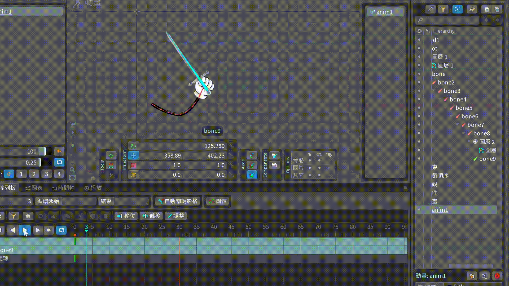

### 互動動畫
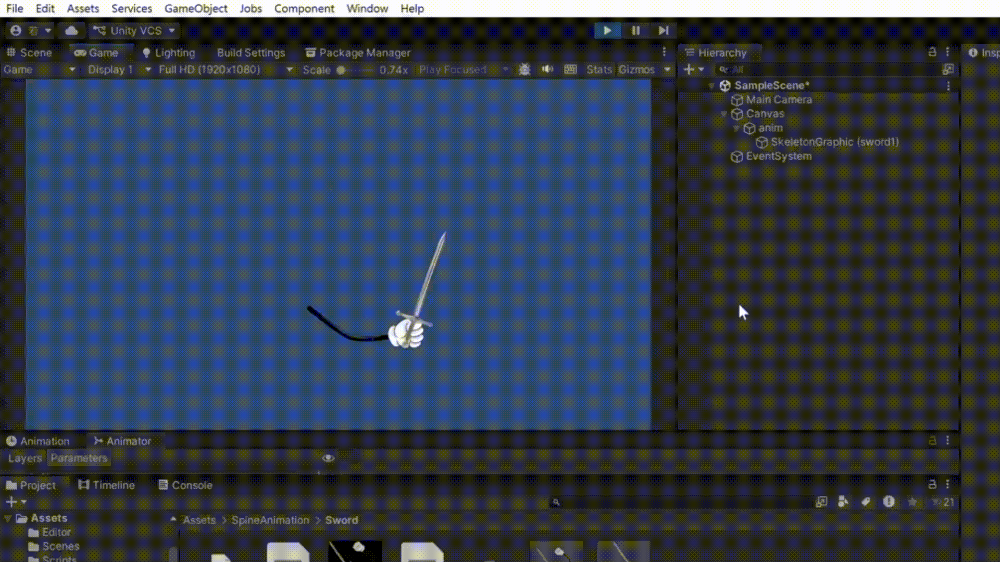

# 感想總結
這一年從熟悉既有專案架構開始，到UI優化、功能開發、Server串接及大型介面改版。
從一開始單純的UI圖片替換，到後續能獨自處理UGUI改版、跨部門合作以及問題分析，使我對Unity大型專案架構與開發流程有了更完整的理解。
未來希望能持續提升設計能力，並參與更多更有挑戰的功能開發項目。
